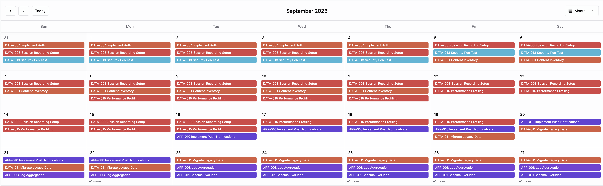

# Sigma Calendar Plugin

A flexible and powerful calendar component for Sigma Computing that displays your data as events across multiple calendar views. Features include month, week, day, and year views with support for both single-day and multi-day events.

## Screenshot



## Features

- **Multiple Calendar Views**: Month, week, day, and year views for different perspectives
- **Event Support**: Single-day events, multi-day events, all-day events, and timed events
- **Interactive Interface**: Click events to trigger actions and set variables
- **Flexible Data Mapping**: Works with any data structure using column selection
- **Color Coding**: Automatic color assignment by category or custom color schemes
- **Responsive Design**: Works seamlessly on desktop, tablet, and mobile devices
- **Customizable Settings**: JSON-based configuration with extensive options
- **Modern UI**: Built with shadcn/ui components and Tailwind CSS

## Quick Start

### 1. Basic Setup

1. Create a workbook with a data table containing events/tasks
2. Add a Plugin element from "UI Elements"
3. Configure required fields:
   - **Data Source**: Your Sigma data table
   - **Event Title**: Column containing event names/titles
   - **Start Date**: Column containing event start dates

### 2. Optional Configuration

Enhance your calendar with additional fields:
- **End Date**: For multi-day events (projects, vacations)
- **Description**: Event descriptions and details
- **Category/Color**: For automatic color coding
- **Additional Fields**: Extra columns to display in event details

### 3. Advanced Configuration

1. Enable **Edit Mode** to access settings
2. Configure calendar behavior:
   - **Default View**: Choose initial calendar view
   - **Week Start**: Sunday or Monday week start
   - **Time Format**: 12-hour or 24-hour display
   - **Event Display**: Control how events appear
   - **Max Events**: Limit events shown per day

## Data Structure & Examples

### Sample Data Format

```
| Event Title       | Start Date | End Date   | Category  | Priority | Assignee  | Description           |
|-------------------|------------|------------|-----------|----------|-----------|----------------------|
| Sprint Planning   | 2024-01-15 | 2024-01-15 | Meeting   | High     | Team      | Plan next sprint     |
| Product Launch    | 2024-01-20 | 2024-01-25 | Project   | Critical | Marketing | Launch new product   |
| Code Review       | 2024-01-22 | 2024-01-22 | Task      | Medium   | Dev Team  | Review pull requests |
| Company Retreat   | 2024-02-01 | 2024-02-03 | Event     | Low      | HR        | Annual team retreat  |
```

### Configuration Example

- **Event Title**: `Event Title`
- **Start Date**: `Start Date`
- **End Date**: `End Date` (optional)
- **Category**: `Category`
- **Additional Fields**: `Priority`, `Assignee`
- **Description**: `Description`

## Calendar Views

### Month View
- Traditional monthly calendar grid
- Events displayed as colored blocks
- Shows multiple events per day
- Configurable event limits with "more" indicator

### Week View
- Seven-day horizontal layout
- More space for event details
- Clear day separation
- Perfect for weekly planning

### Day View
- Single day focus with full event cards
- Complete event details and descriptions
- Ideal for daily scheduling
- Shows all event information

### Year View
- Twelve mini-month overview
- Event indicators on busy days
- Great for long-term planning
- Quick navigation between months

## Event Types

### Single-Day Events
- Meetings, deadlines, appointments
- Display on specific dates
- Can include start/end times

### Multi-Day Events
- Projects, vacations, conferences
- Span across multiple days
- Show duration visually

### All-Day Events
- Holidays, milestones, birthdays
- No specific time requirements
- Special display treatment

### Timed Events
- Events with specific start/end times
- Show time information
- Support for business hours

## Interactivity Features

### Event Clicking
- Configure action triggers for event clicks
- Pass event data to other components
- Build interactive dashboards

### Variables Integration
- **Selected Event ID**: Capture clicked event identifier
- **Selected Date**: Capture clicked date
- Use with filters and other components

### Color Coding
- Automatic colors by category
- Custom color schemes
- Visual event organization
- Category-based filtering

## Settings Configuration

### View Settings
- **Default View**: Initial calendar view (month, week, day, year)
- **Week Starts On**: Sunday or Monday
- **Show Weekends**: Include/exclude weekends
- **Show Week Numbers**: Display week numbers

### Event Display
- **Event Display Style**: Block, list, background, inverse
- **Max Events Per Day**: Limit in month view
- **Event Tooltips**: Hover details
- **Color by Category**: Automatic color coding

### Time & Format
- **Time Format**: 12-hour or 24-hour
- **Event Time Format**: How times are displayed
- **Business Hours**: Define working hours

### Advanced Options
- **Event Click Actions**: Enable/disable interactivity
- **Custom Event Colors**: Define color schemes
- **View-Specific Settings**: Per-view customizations

## Implementation Guide

### Column Information Access

The plugin uses Sigma's `getElementColumns` function for proper column handling:

```javascript
// Column structure
{
  "columnKey123": {
    "name": "Event Title",
    "columnType": "text",
    "id": "columnKey123"
  }
}
```

### Event Processing
1. **Data Validation**: Ensures required columns exist
2. **Date Parsing**: Handles various date formats
3. **Event Creation**: Transforms data into calendar events
4. **Color Assignment**: Applies colors based on categories
5. **Sorting**: Orders events chronologically

### Variable Integration
```javascript
// Set variables on event click
setEventIdVariable(eventId);
setDateVariable(selectedDate);
triggerEventClick();
```

## Customization Examples

### Custom Color Scheme
```json
{
  "eventColorByCategory": true,
  "customEventColors": {
    "Meeting": "#3b82f6",
    "Project": "#ef4444",
    "Task": "#22c55e",
    "Event": "#8b5cf6"
  }
}
```

### View Configuration
```json
{
  "defaultView": "week",
  "weekStartsOn": 1,
  "timeFormat": "24h",
  "dayMaxEvents": 4,
  "showWeekNumbers": true
}
```

### Business Hours Setup
```json
{
  "businessHours": {
    "start": "09:00",
    "end": "17:00",
    "daysOfWeek": [1, 2, 3, 4, 5]
  }
}
```

## Use Cases

### Project Management
- Track project milestones and deadlines
- Visualize project timelines
- Monitor team workload distribution

### Event Planning
- Schedule meetings and events
- Coordinate team activities
- Manage resource allocation

### Task Scheduling
- Daily and weekly task planning
- Deadline tracking
- Priority visualization

### Resource Management
- Equipment booking
- Room scheduling
- Staff allocation

## Best Practices

### Data Preparation
- Use consistent date formats (ISO 8601 recommended)
- Include end dates for multi-day events
- Provide meaningful event titles
- Use categories for organization

### Performance Optimization
- Limit events per day in month view
- Use date filtering for large datasets
- Consider pagination for extensive event lists

### User Experience
- Configure appropriate default view
- Set up meaningful categories
- Use colors consistently
- Provide clear event descriptions

## Troubleshooting

### Common Issues

**Events Not Displaying**
- Check date column format
- Verify required columns are mapped
- Ensure data source is connected

**Incorrect Colors**
- Check category column mapping
- Verify color settings configuration
- Review custom color definitions

**Poor Performance**
- Reduce events per day limit
- Filter data by date range
- Optimize data source queries

### Debug Information

Enable debug logging by checking browser console:
- Event processing details
- Column mapping information
- Date parsing results
- Configuration validation

## Technical Details

### Dependencies
- **React**: Component framework
- **date-fns**: Date manipulation
- **shadcn/ui**: UI components
- **Tailwind CSS**: Styling
- **Lucide React**: Icons

### Browser Support
- Chrome 90+
- Firefox 88+
- Safari 14+
- Edge 90+

### Accessibility
- Keyboard navigation
- Screen reader support
- High contrast compatibility
- Focus management

## Contributing

This plugin follows the established patterns from the Sigma Kanban plugin:
- JSON configuration system
- shadcn/ui component library
- Comprehensive settings panel
- Flexible data processing

## License

Compatible with Sigma Computing plugin ecosystem.

---

For more information about Sigma Computing plugins, visit the [Sigma Computing documentation](https://help.sigmacomputing.com/). 